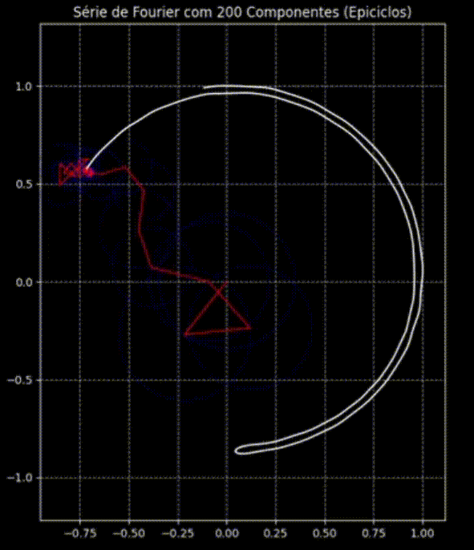

# 🌀 Fourier Drawing com Epiciclos

Este projeto transforma imagens vetoriais (SVG) em animações usando **epiciclos**, que são círculos girando dentro de outros círculos. Através do poder da **Série de Fourier**, decompomos o contorno de uma imagem em um conjunto de vetores rotativos que, quando somados, recriam o desenho original de forma contínua e elegante.

<div align="center">
  
</div>

-----
## ✨ O Conceito por Trás da Mágica

A **Série de Fourier** é uma ferramenta matemática que permite decompor uma função periódica (como o contorno de uma forma fechada) em uma soma de funções seno e cosseno de diferentes frequências e amplitudes. No plano complexo, cada um desses termos pode ser visualizado como um vetor que gira em um círculo — um **epiciclo**.

Ao combinar dezenas ou centenas desses epiciclos, onde o centro de um círculo está na borda do anterior, a ponta do vetor final traça a forma original. Este projeto automatiza o processo:

1.  Extrai os pontos de uma imagem SVG.
2.  Aplica a **Transformada Discreta de Fourier (DFT)** para encontrar os coeficientes (frequência, amplitude e fase) de cada epiciclo.
3.  Usa esses coeficientes para gerar uma animação que reconstrói a imagem.
-----
## 📂 Estrutura do Projeto
```
├── Makefile                # Script para build, processamento e execução
├── doc.pdf                 # Documentação do projeto
├── README.md               
├── LICENSE                 # Licença do projeto
├── requirements.txt        # Dependências Python
├── svg/                    # Arquivos SVG usados para entrada (formas vetoriais)
├── src/
│   ├── cpp/
│   │   ├── bin/            # Local para binários compilados
│   │   ├── DFT.cpp         # Código C++ que calcula a Transformada de Fourier discreta
│   │   ├── input.csv       # Contém os pontos 2D extraídos do SVG
│   │   ├── output.json     # Contém os coeficientes da série de Fourier gerados aplicando DFT nos pontos 2D
│   ├── python/
│   │   ├── animar_fourier.py   # Script para visualização animada dos coeficientes de Fourier
│   │   ├── parser.py           # Script para ler SVG e gerar arquivo CSV de pontos
```
## 🛠️ Dependências

Para executar este projeto, você precisará dos seguintes componentes:

### Sistema

  - Um compilador C++ com suporte para **C++23** (ex: `g++ 12+` ou `clang++ 15+`).
  - **Python 3.8** ou superior.

### Bibliotecas Python

É altamente recomendado criar um ambiente virtual para instalar as dependências.

```bash
# Crie e ative um ambiente virtual
python3 -m venv .venv

# No Linux/macOS:
source .venv/bin/activate

# No Windows (PowerShell):
.venv\Scripts\activate
```

Depois, instale as bibliotecas necessárias a partir do arquivo `requirements.txt`:

```bash
pip install -r requirements.txt
```

## 🚀 Como Compilar e Executar

O projeto utiliza um `Makefile` para simplificar a compilação e a execução de todas as etapas.

#### Comando Padrão

Para compilar e rodar o fluxo completo com a imagem padrão (`svg/github_logo.svg`):

```bash
make
```

#### Compilando para um SVG Específico

Para processar uma imagem diferente (ex: `twitter_logo.svg` que deve estar na pasta `svg/`), use o nome do arquivo (sem a extensão `.svg`) como alvo:

```bash
make twitter_logo
```

Este comando irá compilar o C++ e gerar o arquivo JSON com os coeficientes de Fourier para a nova imagem.

#### Executando a Animação para um SVG Específico

Para compilar, processar e rodar a animação de uma vez:

```bash
make twitter_logo run
```

#### Rodar Apenas a Animação

Se você já gerou o arquivo de coeficientes (`output.json`) e quer apenas visualizar a animação novamente:

```bash
make run
```
## 🎨 Customização

Você pode facilmente usar suas próprias imagens\!

  - **Adicione seu SVG**: Coloque seu arquivo `.svg` na pasta `svg/`.
  - **Execute o Makefile**: Rode `make nome_do_seu_arquivo` para processá-lo.
  - **Ajuste de Parâmetros**: Para obter mais ou menos detalhes na aproximação, você pode ajustar a quantidade de pontos amostrados no `parser.py` e o número de epiciclos a serem animados em `animar_fourier.py`.
  - **Recomendações**: Recomenda-se o uso de line arts simples para melhor performance e resultado.
-----   
## 📚 Momento cultural

Este projeto implementa a DFT (Transformada Discreta de Fourier) de forma direta, com complexidade O(n²), que é o coração matemático da representação por epiciclos.

A Transformada Rápida de Fourier (FFT), uma versão otimizada com complexidade O(n log n), revolucionou a ciência e a engenharia ao permitir o processamento eficiente de sinais, imagens e dados em diversas áreas, desde compressão de áudio e vídeo até comunicação digital.

Mais importante ainda, conforme explicado no canal Veritasium no vídeo [*The Most Important Algorithm Of All Time*](https://www.youtube.com/watch?v=nmgFG7PUHfo), a FFT desempenhou um papel crucial na história mundial ao ajudar a detectar testes nucleares secretos. Essa capacidade de analisar rapidamente sinais sísmicos ajudou a evitar uma possível escalada da corrida armamentista nuclear durante a Guerra Fria, mostrando como um avanço matemático pode ter impacto direto na paz global.

Assim como a FFT transformou nosso mundo moderno, explorar as séries de Fourier e suas aplicações artísticas é um convite para entender como a matemática pode modelar e criar beleza.

Referência cultural:  
[](https://www.youtube.com/watch?v=nmgFG7PUHfo)
-----
***Divirta-se explorando as formas com epiciclos e Séries de Fourier!***
